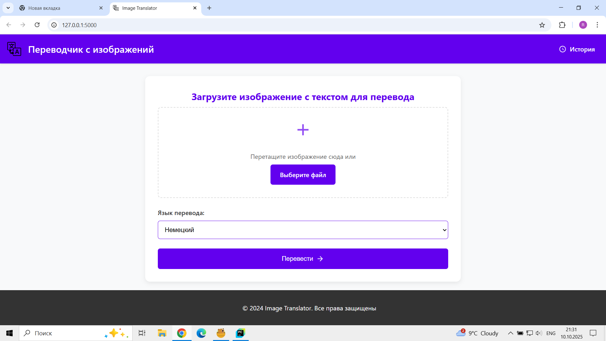
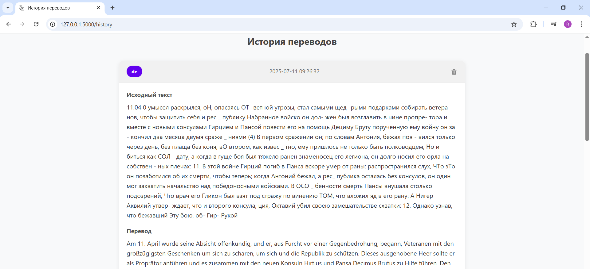

# Веб-сервис для перевода текста с изображений

Прототип веб-приложения на **Flask**, который позволяет:
- загружать изображения с текстом,
- распознавать текст через **EasyOCR**,
- переводить его на выбранный язык через **Gemini API**,
- сохранять историю переводов в базе данных с возможностью просмотра, редактирования и удаления.

Проект демонстрирует навыки интеграции ML-моделей в веб-приложение, работу с API и базами данных.

---

## 🚀 Основной функционал
- Загрузка и обработка изображений  
- Распознавание текста (OCR)  
- Перевод текста через LLM (Gemini API)  
- Сохранение истории в базе данных (MySQL)  
- Просмотр истории, редактирование и удаление переводов  

---

## 🛠️ Стек технологий и навыки
- **Python 3, Flask** — веб-сервер и маршрутизация  
- **EasyOCR** — извлечение текста из изображений  
- **Google Gemini API** — генерация перевода текста  
- **MySQL** — хранение данных и история переводов  
- **HTML/CSS/Jinja2** — фронтенд приложения  
- **Навыки, демонстрируемые проектом:** ML-интеграция, работа с API, обработка изображений, работа с базами данных, создание end-to-end приложений  

---

## ⚙️ Установка и запуск

1. Клонируйте репозиторий:  
```bash
git clone https://github.com/username/project.git
cd project
```
2. Создайте виртуальное окружение и активируйте его:
```bash
python -m venv venv
source venv/bin/activate   # Linux / Mac
venv\Scripts\activate      # Windows
```

3. Установите зависимости:
```bash
pip install -r requirements.txt
```

4. Создайте файл config.py (не храните в репозитории, добавьте в .gitignore):
```bash
DB_CONFIG = {
    'host': '127.0.0.1',
    'user': 'ваш_пользователь',
    'password': 'ваш_пароль',
    'database': 'translator',
    'port': 3306
}

API = "ваш_api_ключ"
```

5. Настройте базу данных:
```bash
CREATE DATABASE translator;
USE translator;

CREATE TABLE users (
    id INT AUTO_INCREMENT PRIMARY KEY,
    photo_path VARCHAR(255),
    lang VARCHAR(10),
    text_before TEXT,
    text_after TEXT,
    created_at TIMESTAMP DEFAULT CURRENT_TIMESTAMP
);
```

6. Запустите сервер:
```bash
python app.py
```

7. Откройте браузер:
```bash
http://127.0.0.1:5000/
```
📌 Примечания

* Требуется API-ключ Gemini; для работы может понадобиться VPN

* Папка uploads/ создаётся автоматически

## 📸 Скриншоты сайта

Главный интерфейс:  


История переводов:  

